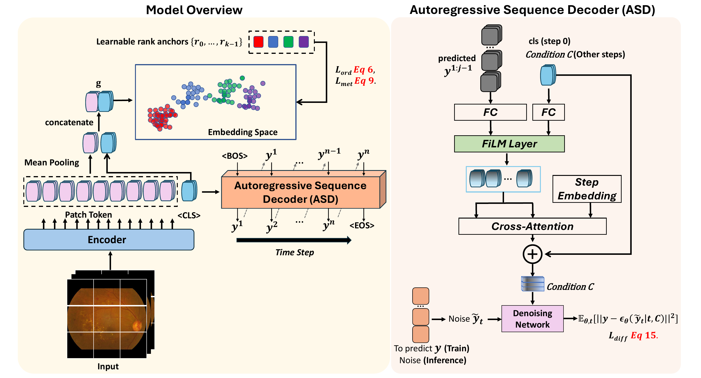

# DiffGeo-AOR
## Diffusion-Optimized Medical Grading via Geometric Priors enhanced Autoregressive Ordinal Regression

Diffusion-optimized autoregressive ordinal regression for medical image grading.

This repository is the **journal extension** of [AOR-DR](https://github.com/Qinkaiyu/AOR-DR), where AOR-DR corresponds to the MICCAI 2025 conference version.

- `AOR-DR`: MICCAI 2025 conference version.
- `DiffGeo-AOR` (this repo): journal extension with expanded method/analysis and a cleaner unified code pipeline.
- If you are already familiar with AOR-DR, you can directly use this repository for extension experiments.

## Overview
<p align="center">
  
</p>

## Using This After AOR-DR (Quick)

1. Prepare data in `.npy` format and update paths in `main_npy.py` (`dataset_specs`).
2. Run training/test with `python main_npy.py`.
3. Run test with `python test_npy.py`.

## Repository Layout

```text
DiffGeo-AOR/
  main_npy.py              # unified train/test pipeline
  test_npy.py              
  build_model.py            # model builders + feature extractors
  preprocess_to_npy.py
  diffloss.py               # diffusion loss wrapper
  util.py                   # FiLM / fusion / rank-prior utilities
  dataloader.py             # dataset helpers
  diffusion/                # diffusion core implementation

  amd.csv  # AMD evaluation split IDs
```

## Environment


## Dataset Configuration

Training script uses dataset presets inside `main_npy.py` (`dataset_specs`):
- `AORDR_DATASET=eyeq` (2D ViT)
- `AORDR_DATASET=ddr` (2D ViT)
- `AORDR_DATASET=amd` (3D ResNet)

Each preset contains paths for:
- image `.npy`
- label `.npy`
- checkpoint path
- (AMD only) `ids_txt` and `gamma_test_ids_fold0.csv` selection

Before running, update local data/checkpoint paths in `main2_npy.py` to your environment.

## Quick Start

Run training pipeline:

```bash
# default: amd
python main_npy.py
```

Examples by dataset:

```bash
AORDR_DATASET=ddr python main_npy.py
AORDR_DATASET=eyeq python main_npy.py
AORDR_DATASET=amd python main_npy.py
```

Optional split override:

```bash
AORDR_DATASET=ddr AORDR_TRAIN_SPLIT=train AORDR_TEST_SPLIT=test python main_npy.py
```

## Test

Run:

```bash
python test_npy.py
```
## Checkpoint

[link](https://drive.google.com/drive/folders/1cIexxsZroKMJRVhyebzJ7w54QTnWAsvO?usp=drive_link)

